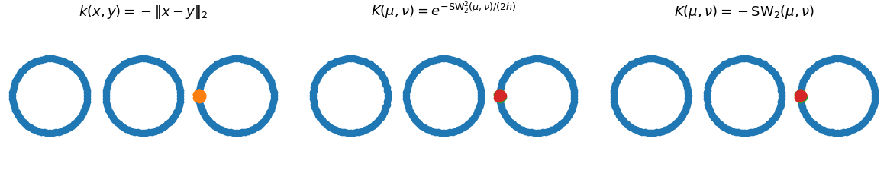

# Flowing Datasets with Wasserstein over Wasserstein Gradient Flows

This repository contains the code to reproduce the experiments of the paper [Flowing Datasets with Wasserstein over Wasserstein Gradient Flows](https://openreview.net/forum?id=I1OHPb4zWo). In this paper, we derive gradient flows in the space of probability distributions over probability distributions endowed with the Wasserstein over Wasserstein distance. Moreover, we propose to flow datasets by minimizing the Maximum Mean Discrepancy with kernels based on the Sliced-Wasserstein distance.



## Abstract

Many applications in machine learning involve data represented as probability distributions. The emergence of such data requires radically novel techniques to design tractable gradient flows on probability distributions over this type of (infinite-dimensional) objects. For instance, being able to flow labeled datasets is a core task for applications ranging from domain adaptation to transfer learning or dataset distillation. In this setting, each class can be  represented by the associated conditional distribution of features, and the dataset is a mixture distribution supported on these classes (which are themselves probability distributions), meaning that labeled datasets can be seen as probability distributions over probability distributions. We endow this space with a metric structure from optimal transport, namely the Wasserstein over Wasserstein (WoW) distance, derive a differential structure on this space, and define WoW gradient flows. The latter enables to design dynamics over this space that decrease a given objective functional. We apply our framework to transfer learning and dataset distillation tasks, leveraging our gradient flow construction as well as novel tractable functionals that take the form of Maximum Mean Discrepancies with Sliced-Wasserstein based kernels between probability distributions.

## Citation

```
@inproceedings{bonet2025flowing,
  title={{Flowing Datasets with Wasserstein over Wasserstein Gradient Flows}},
  authors={Bonet, Clément and Vauthier, Christophe and Korba, Anna},
  booktitle={International Conference on Machine Learning},
  year={2025}
}
```

## Description of the code

In this work, we aim at learning a distribution $\mathbb{P}=\frac{1}{C}\sum_{c=1}^C\delta_{\mu_c^n} \in \mathcal{P}_2(\mathcal{P}_2(\mathbb{R}^d))$ with $\mu_c^n$ a discrete distribution. For instance, a labeled dataset can be represented under this form, as each class can be written as $\mu_c^n$.

To do this, we minimize $\mathbb{F}(\mathbb{P})=\frac12 \mathrm{MMD}_K^2(\mathbb{P},\mathbb{Q})$ with $\mathbb{Q}$ a target labeled dataset of the same form as $\mathbb{P}$, and $K$ a positive definite kernel between probability distributions.


We solve this minimization problem using Wasserstein over Wasserstein (WoW) gradient flows, which are approximated using an explicit scheme of the form, for all $c\in\{1,\dots,C\}$, $i\in\{1,\dots, n\}$,

$$
	x_i^c = x_i^c - \tau \nabla_{\mathrm{W}_{\mathrm{W}_2}} \mathbb{F}(\mathbb{P}_k)(\mu_c^n)(x_i^c).
$$

The WoW gradient $\nabla_{\mathrm{W}_{\mathrm{W}_2}} \mathbb{F}(\mathbb{P}_k)$ can be computed either in closed-form, or by using autodifferentiation w.r.t the particles and rescaling the gradient by $Cn$.

In practice, the distributions are modeled as arrays of shape $(C,n,d)$. The functions to compute the WoW gradients of the MMD with Gaussian SW kernel $K(\mu,\nu)=e^{-\mathrm{SW}_2^2(\mu,\nu)}$ or the Riesz SW kernel $K(\mu,\nu)=-\mathrm{SW}_2(\mu,\nu)$ are in `lib/mmd.py`. Then, these function can be plugged in the `wasserstein_gradient_descent` functions in the file `lib/gd.py` or `lib/gd_images`. Here is an example of syntax. More examples can be found in the notebook `MMD - SW based Kernel - Rings.ipynb`.


```
import jax
from lib.gd import wasserstein_gradient_descent
from lib.mmd import target_value_and_grad_riesz

rng = jax.random.PRNGKey(0)
master_key, key, key_x0, key_tgt = jax.random.split(rng, num=4)

# x0 and X_data are of shape (C, n, d), see Ring notebook for an example
x0 = jax.random.normal(key_x0, shape=(3, 80, 2))
X_data = jax.random.normal(key_tgt, shape=(3, 80, 2))

n_epochs = 501
L_loss, L_particles = wasserstein_gradient_descent(x0, X_data, jax.jit(target_value_and_grad_riesz), key, n_epochs=n_epochs, lr=0.1)
```


## Experiments

You can install all the needed packages by running 
```
pip install -r requirements.txt
```

- Figure 1 and figures of Appendix D.2 can be reproduced by running the notebook `MMD - SW based Kernel - Rings.ipynb`.
- Figure 2 and figures of Appendix D.3 and D.4 can be reproduced by running the notebooks in the folder `xp_generative_modeling`.
- Figure 3 can be reproduced using the code in the folder `xp_domain_adaptation`. The command lines to run are in the file `run.sh`.
- The Dataset Distillation experiment (Table 1) is available in the `xp_dataset_distillation` folder. The command lines to run are in the file `run.sh`.
- The Transfer Learning experiment (Table 2) is available in the folder `xp_transfer_learning`. The command lines to run are in the file `run.sh`.

